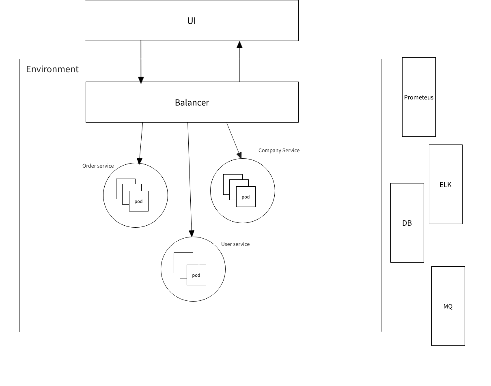

## Системная архитектура
Представляет собой набор из 3 микросервисов:
1. Order service - сервис заказов услуг
2. Company service - сервис описания компаний
3. User service - сервис по хранению данных пользователей

## Микро-архитектура приложения
Представляет собой модульную архитектуру

## Описание сущностей

Order
* ID
* companyId
* userId
* date
* address

Company
* Id
* Name
* Description

User
* Id
* Phone

