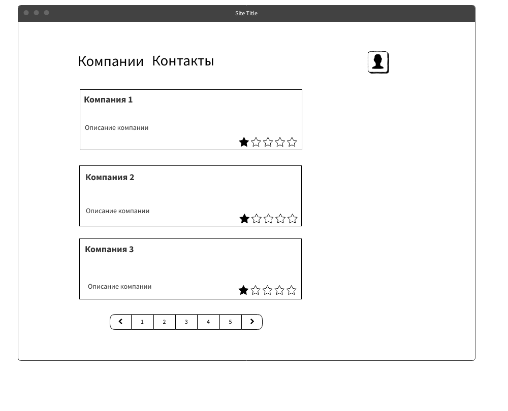
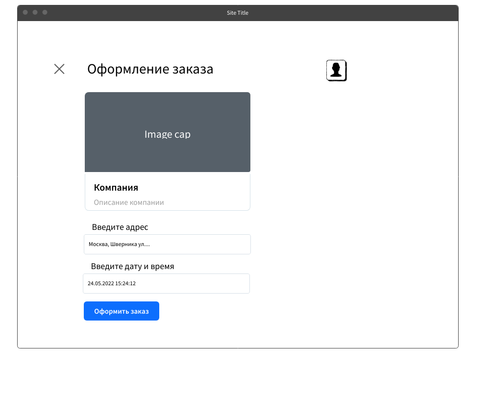

## MVP
Возможность зайти по номеру телефона. Выбрать компанию. Выбрать место и дату, создать заказ.
По итогу заказ увидит компания и свяжется с клиентом. Условия заказа/стоимость и прочие детали
обсуждаются пока телефону.

## Эскиз фронт енда
Клиент заходит по номеру телефона. Появляется главная страница со списком компаний
и информации о сервисе/приложении. 
После выбора компании при нажатии на нее открывается второй экран с оформление заказа
 
Если нажать на кнопку, то заказ оформится и появится модалка, которая будет редеректить на главная
в которой уже будет информация о заказах.
